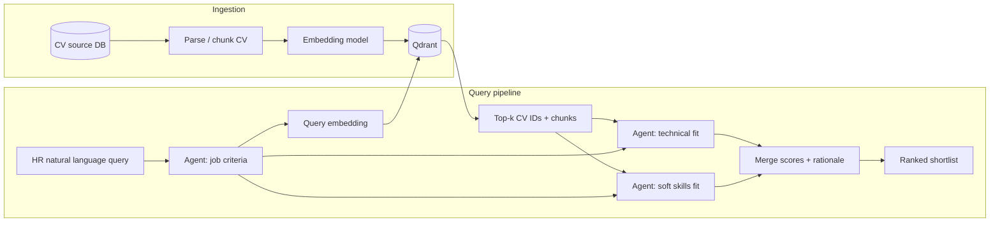

# CV discovery pipeline — development document

This document is the agreed starting point for implementation: semantic retrieval over CVs stored in **Qdrant**, followed by a **multi-agent workflow** (Microsoft Agent Framework) that structures the HR query, scores candidates on technical and soft-skill dimensions, and returns ranked, explainable results.

---

## 1. Goals and success criteria

### 1.1 Product goals

- Let HR describe needs in natural language (e.g. “Java developer, 5+ years”) and get a **shortlist of top-k CVs** with **transparent reasons** (which requirements matched, gaps, scores).
- Scale to **many CVs** in a database without linear scan of full text on every query.
- Keep outputs **auditable**: scores and bullet rationales HR can challenge or refine.

### 1.2 Technical goals

- **Retrieval**: Fast, approximate nearest-neighbor search over CV embeddings in **Qdrant**.
- **Orchestration**: A single pipeline implemented as an **Agent Framework workflow** (agents + tools), not ad-hoc scripts.
- **Consistency**: Structured outputs (JSON schemas) from LLM steps where possible, to simplify UI and downstream storage.

---

## 2. Is this a good starting point?

**Yes.** The split you propose maps well to how these systems are usually built:

| Stage | Role |
|--------|------|
| Embedding + vector search | **Recall**: surface plausible candidates from a large corpus. |
| “Key points” agent | **Query understanding**: normalize HR language into checkable criteria. |
| Technical / soft-skill agents | **Precision & explanation**: score and justify fit on orthogonal axes. |

**Caveats (plan for them early):**

1. **Embeddings alone under-specify constraints.** “At least 5 years Java” is partly structured; pure semantic similarity can rank strong generalists above strict matches. Mitigations: hybrid search (dense + keyword/BM25), metadata filters (years, location), and/or chunking strategies that preserve employment timelines.
2. **LLM scores (0–1) are not calibrated** across sessions or models. Treat them as **relative ranks within a batch** unless you add calibration or human-in-the-loop feedback.
3. **Cost and latency** grow with k × number of agents. Start with **retrieve top 50 → rerank / score top 10–20** rather than scoring hundreds with three agents each.

This is a **strong v1**; “best” always depends on data quality and HR workflow, but this architecture is a standard, evolvable baseline.

---

## 3. High-level architecture

**Recommended flow:**

1. **Criteria agent** — From the HR question, produce a structured object: must-have / nice-to-have skills, seniority, domain, constraints, and optional **search query text** optimized for embedding (or multiple sub-queries).
2. **Retrieval** — Embed query (or multiple vectors), search Qdrant with filters if metadata exists; return **top k** points (see §5).
3. **Parallel scoring agents** — For each candidate in the working set (or batched), **technical** and **soft-skills** agents each output **per-criterion scores in [0, 1]** plus short evidence strings (quotes or paraphrases from retrieved chunks).
4. **Merge** — Combine vector similarity rank, structured filters, and agent scores into a final ranking and narrative summary.

Use **Microsoft Agent Framework** workflows to encode this graph, with **tools** for: Qdrant search, loading full CV text by ID from your DB, and optional structured parsing helpers.

---

## 4. Data model and Qdrant design

### 4.1 What to store in Qdrant

- **Unit of indexing**: Prefer **chunks** (e.g. 512–1024 tokens with overlap) rather than one vector per whole CV, so retrieval can point to **evidence spans**. Keep a **payload** field `cv_id` on every point to group chunks per person.
- **Payload (recommended)** — At minimum: `cv_id`, `chunk_index`, `source` (e.g. section: experience, education). If extractable reliably: `years_experience_java`, `primary_skills[]`, `location`, `last_updated` — these enable **filters** and hybrid strategies later.

### 4.2 Collections

- **v1**: Single collection `cv_chunks` with one embedding model and consistent dimension.
- **Later**: Optional second collection for “structured profile” embeddings (normalized skill list + summary) if you split lexical vs semantic retrieval.

### 4.3 Vector configuration

- Choose **one embedding model** and fix **dimension** in collection config; document model name and version in config for reproducibility.
- Use **named vectors** in Qdrant only if you introduce multiple models; otherwise a single default vector is simpler.

### 4.4 Ingestion pipeline (offline)

1. Read CV from your DB (PDF/HTML/text).
2. Normalize text; optional PII handling policy (redaction, hashing of identifiers).
3. Chunk; embed batches; upsert to Qdrant with payloads.
4. Store **ingestion version** (parser + model + chunk params) so you can re-embed when the pipeline changes.

---

## 5. Retrieval strategy

### 5.1 Query path

1. Criteria agent outputs structured criteria + **retrieval query string** (or list of strings for multi-vector search).
2. Compute query embedding(s); call Qdrant `search` with `limit` = k′ (e.g. 50–100 chunk hits).
3. **Collapse by `cv_id`**: aggregate chunk scores per CV (e.g. max score, or weighted mean of top 3 chunks) to produce **top k CVs** (e.g. k = 20).
4. Pass **top CVs** with their **top chunks** as context to scoring agents.

### 5.2 Improving “years of experience” and hard constraints

- **Metadata filters** in Qdrant when fields exist and are trustworthy.
- **Hybrid**: add sparse retrieval (e.g. BM25 in a separate store or Qdrant sparse vectors if used) for exact tokens (“Java”, “Spring”, certifications).
- **Post-filter**: lightweight rule or small model pass on structured fields before expensive agent scoring.

---

## 6. Multi-agent workflow (Microsoft Agent Framework)

### 6.1 Agents (conceptual)

| Agent | Input | Output (structured) |
|--------|--------|----------------------|
| **Criteria / planner** | HR question | Job spec: requirements list, seniority, weights, retrieval query text, optional filters |
| **Technical rater** | Job spec + CV chunks | Scores [0,1] per technical criterion + evidence snippets |
| **Soft-skills rater** | Job spec + CV chunks | Scores [0,1] per soft-skill criterion + evidence snippets |

Optional **fourth** agent later: **synthesizer** that writes the HR-facing summary and flags inconsistencies between technical and soft scores.

### 6.2 Tools (examples)

- `search_cvs(query, filters, top_k)` — wraps Qdrant.
- `get_cv_document(cv_id)` — loads full text or all chunks from DB/storage.
- `parse_date_range(text)` — only if you need deterministic date math outside the LLM.

### 6.3 Scoring contract

- Define **JSON schemas** for each agent output (Pydantic models or equivalent).
- Each score in **[0, 1]** with **named dimensions** (e.g. `java_proficiency`, `system_design`, `communication`, `leadership`).
- Require **evidence**: 1–3 short strings referencing retrieved content (reduces hallucinated praise).

### 6.4 Workflow pattern

- **Sequential**: Criteria → retrieve → fan-out parallel technical + soft for each CV (or batched prompts).
- **Merge step**: deterministic Python combining function: weighted sum aligned to HR weights from criteria agent, plus tie-break using vector similarity.

---

## 7. API and product surface (implementation targets)

- **POST /discover** — Body: `{ "query": "...", "top_k": 20 }` → returns ranked list with scores, criteria used, and evidence.
- **POST /ingest/cv** or batch job — For indexing new/updated CVs into Qdrant.
- **GET /health** — Includes Qdrant connectivity and embedding model readiness.

(Auth, tenancy, and PII are out of scope for this doc but must be decided before production.)

---

## 8. Implementation phases

### Phase 0 — Foundations

- Python project deps: `agent-framework`, `qdrant-client`, embedding SDK, HTTP API framework (e.g. FastAPI), config via env.
- Docker (or managed) Qdrant; local `.env` for URL and API key.

### Phase 1 — Ingestion + Qdrant

- CV fetch from your DB; parse/chunk; embed; upsert with payloads.
- CLI or job: `reindex --since ...`.

### Phase 2 — Retrieval only

- Implement `search_cvs` tool and collapse-by-`cv_id` logic; expose minimal API returning IDs + chunks (no agents).

### Phase 3 — Agent workflow

- Criteria agent + schemas; wire workflow; technical + soft agents; merge rankings.
- End-to-end `/discover`.

### Phase 4 — Quality and operations

- Logging, tracing, cost estimates per query; optional human feedback loop to tune weights.
- Evaluation set: labeled “good/bad” matches for regression after model changes.

---

## 9. Non-goals (v1)

- Fully automated hiring decisions.
- Legally binding “years of experience” without human verification of parsed timelines.
- Real-time indexing without a defined consistency model (assume near-real-time or batch is acceptable unless specified).

---

## 10. Open decisions (to lock before coding)

1. **Source of truth** for full CV text: same DB as today vs object storage.
2. **Embedding model** and whether queries and documents must use the same model (usually yes).
3. **Languages** of CVs and queries (multilingual model vs single language).
4. **k and k′** defaults and max caps for cost control.
5. **PII** handling and retention for logs that contain CV excerpts.

---

## 11. References (for implementers)

- [Microsoft Agent Framework](https://github.com/microsoft/agent-framework) — workflows, agents, tools.
- [Qdrant documentation](https://qdrant.tech/documentation/) — collections, payloads, filtering, hybrid search.

---

*Document version: 0.1 — starting point for implementation.*
